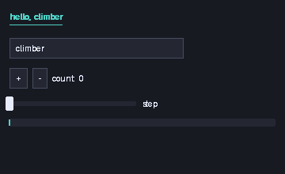

# Your first GUI

nexium-gui is an immediate-mode toolkit written in Nexium: a software
rasterizer drawing into a framebuffer, a bitmap font, layout and widgets,
with about two hundred lines of C to open a window and blit. It ships with
the repository under `gui/`, and this is a counter written with it.

{{include gui/counter.nx}}

```bash
$ nx run gui/counter.nx                        # a window
$ nx run gui/counter.nx -- --shot frame.ppm    # one frame, drawn offscreen
```



## The model

Widgets are function calls made every frame. `ui.button("+")` draws a
button *and* returns whether it was clicked this frame; `ui.slider("step",
&mut step, 1.0, 10.0)` draws a slider, writes the new value through the
pointer, and returns whether it changed. There is no widget tree to build,
no callbacks, no event handlers: the application's state is the
application's own variables, and the frame loop reads and writes them.

```nexium
    while ui.begin_frame() {
        ...
        ui.end_frame()
    }
```

`begin_frame` pumps the window's events, resets the layout and clears the
canvas, and returns `false` once the window is closed; `end_frame` presents
the frame. Between the two, the widgets go top to bottom, `same_line()` puts
the next one to the right of the last, `space(px)` and `separator()` are
the layout.

This suits a language with explicit ownership well: nothing outlives the
frame, so nothing is shared, so there is nothing to reference-count or lock.
It is the model of egui and Dear ImGui.

## Headless

```nexium
    var ui = nexium_gui.Ui.headless(360, 220)
```

`Ui.headless(w, h)` is a `Ui` with a canvas and no window. The program
draws one frame into it and saves the canvas with `save_ppm`, which is how
this page has a picture and how the test suite checks the GUI without a
display: `nx test gui/nexium_gui.nx` runs the toolkit's own tests headless,
and the harness renders this counter's frame on every run.

`Ui.open(title, w, h)` returns `null` on a platform with no backend; the
program above falls back to a message. The Win32 backend is in `gui/`
today; X11, Wayland and Cocoa are on the roadmap (1.5).

## What is there

Widgets: `label`, `dim_label`, `heading`, `button`, `checkbox`, `slider`,
`text_input`, `progress`, `separator`, `space`, `panel`. Free drawing on
`ui.canvas`: `fill_rect`, `rect`, `fill_rounded`, `hline`, `vline`, `text`,
`set`/`get` a pixel, with colours as `0x00RRGGBB` and helpers `rgb`, `mix`,
`hue_color`. Two themes, `dark_theme()` and `light_theme()`, and the
`ui.theme` you can edit. The whole of `gui/nexium_gui.nx` is under a
thousand lines and every part of it is ordinary Nexium, which makes it the
best next thing to read if you want to write a widget.

The `import nexium_gui` line finds `gui/nexium_gui.nx` next to
`gui/counter.nx`; a program elsewhere would use it as a path dependency
(chapter 19). `artifact link { c_sources = ["platform.c"] }` inside the
toolkit is what compiles the window layer in, and it says what to link per
platform (`libs_windows = ["user32", "gdi32"]`).

Next: [packages](19-packages.html).
